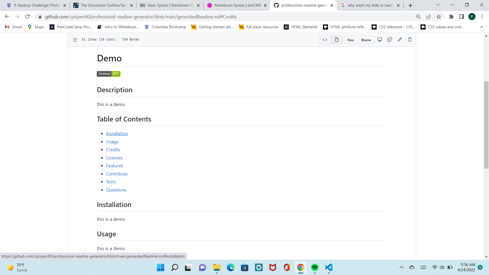
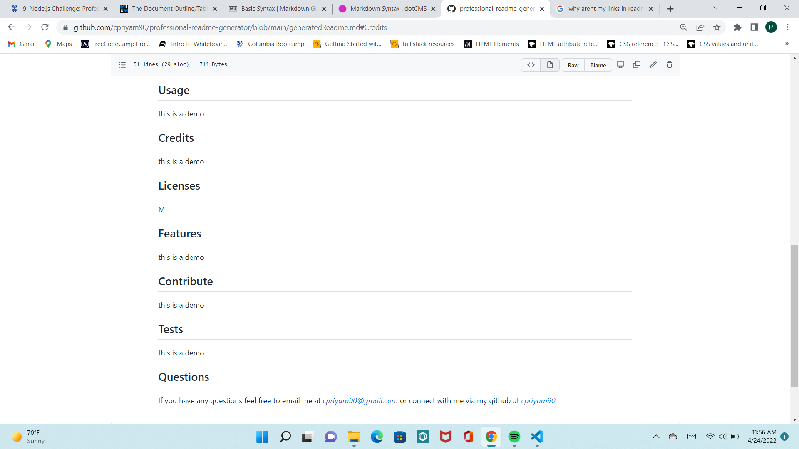

# professional-readme-generator

## Description
This application helps a user generate a professional ReadMe using Node.js from their terminal.

## Table of Contents
* [Usage](#Usage)
* [Credits/Citations](#Credits/Citations)
* [Features](#Features)
* [Applications-Used](#Applications-Used)
* [Screenshots](#Screenshots)
* [Video-Link](#Video-Link)

## Usage
To generate a Readme, user must have Node.js installed and then run the command node index.js from your terminal. The user will be prompted to answer a few questions and will also be asked their email and Github username. Once completed, a new Readme file will be generated called generatedReadme. 

## Credits/Citations
* Tutor Abdullah explained what inquirer is and how to install inquirer package on my repo
* TA Charlie explained how customizable shields.io is for badges
* Shields.io for generating license badges
* License information found on https://choosealicense.com/licenses/
* Professional readme guide found on this link shared in assignment instructions https://coding-boot-camp.github.io/full-stack/github/..,professional-readme-guide
* Markdown guide from https://www.markdownguide.org/cheat-sheet/
* Module 9 lessons on Node.js
* Starter code provided in assignment to get an understanding of the scope of the assignment

## Features
The user can link their email and Github repo to the generated readme. The readme will also generate a license badge at the top based on user's selection. The table of contents link to corresponding sections in the newly created readme.

## Applications-Used
* Node.js
* Inquirer
* Markdown
* JavaScript

## Screenshots
See below screenshots of generated Readme

## Video-Link

